# A comprehensive guide to 360 photos on Google maps
<a name="top"></a>
A how to guide on **creating**, **uploading** and **updating** 360 photos on Google maps with **no API key needed!**

This is meant for **everyone** - **beginners** with little technical knowledge up to **professionals**.


| Symbol        | Meaning           |
| ------------- |:-------------:|
| 🟢| Easy. Little technical knowledge is required. |
| 🟡| Medium. Some technical knowledge is required.      |
| 🔴| Hard. A lot of technical knowledge is required.      |
| ⚪| Unrated. Usually just information.|

**Don't let these symbols scare or discourage you though!**

### Table of contents

  * [Creating 360 photo spheres (phone) 🟢/🟡](#creating-360-photo-spheres-phone-)
  * [Uploading 360 photos to Google maps 🟢](#uploading-360-photos-to-google-maps-)
  * [Photos upload info/FAQ ⚪](#photos-upload-infofaq-)
  * [A useful glossary ⚪](#a-useful-glossary-)
  * [Deleting uploaded photos 🟢/🟡](#deleting-uploaded-photos-)
    * [Deleting using the contributions tab 🟢](#deleting-using-the-contributions-tab-)
    * [Deleting using the API 🟡](#deleting-using-the-api-)
  * [Finding a placeId 🟢](#finding-a-placeid-)
  * [Getting a photo's heading before it was shot 🟢](#getting-a-photos-heading-before-it-was-shot-)
  * [Using APIs - general guide 🟡](#using-apis---general-guide-)
  * [Listing your uploaded photos 🟢 - 🔴](#listing-your-uploaded-photos----)
    * [Using the contributions tab 🟢](#using-the-contributions-tab-)
    * [Using the API 🟡/🔴](#using-the-api-)
      * [How to actually find your photo in the JSON?](#how-to-actually-find-your-photo-in-the-json)
      * [How to download your photos](#how-to-download-your-photos)
  * [Updating photos' information 🟡](#updating-photos-information-)
    * [Updating heading](#updating-heading)
    * [Updating linked places (placeIDs)](#updating-linked-places-placeids)
    * [Updating location](#updating-location)
    * [Updating connections (Linking photos)](#updating-connections-linking-photos)
      * [Single connections](#single-connections)
      * [Multiple connections](#multiple-connections)
    * [Updating pitch and roll](#updating-pitch-and-roll)
    * [Updating level](#updating-level)
    * [Updating altitude](#updating-altitude)

## Creating 360 photo spheres (phone) 🟢/🟡
[⬆ Back to top](#top)

If you already have a 360 photo or are using a specialized camera to create them, feel free to skip this section.

Getting a working app is **really hard**. There is **no universal working app** that's free to take 360 photos. There are a lot of paid apps to create 360 photos which work and some free ones which work for some users but don't for others.

I personally use [Go Street View Photo Sphere 🟢](https://play.google.com/store/apps/details?id=com.gostreetview.camera) (android) despite it not working for a lot of people.

Some people also use the **deprecated** [Street view app from Google 🟡](https://www.apkmirror.com/apk/google-inc/street-view/). You can download the latest version to see if it works for you (it didn't for me), or one of the older versions (I remember one of the old ones working). You can still test out different versions - maybe one of them will work.

I'm not aware of any other working apps (especially for iPhone) which are free, so **any suggestions are appreciated!**

You can also use an app like [Hugin 🟡/🔴](https://hugin.sourceforge.io/) to **stitch together** a bunch of **normal photos**.

-----
If you are planning on making a **photo tour** OR you want your photo to **have a heading**, I recommend reading [how to get a photo's heading 🟢](#getting-a-photos-heading-before-it-was-shot-) first.

When you have your app, you can take the 360 pictures using it! The method will **depend on the app**, but most apps usually work like this:
You first take an initial photo somewhere around you - usually at the mid point. Then 4 points appear around the photo (top, right, left, bottom) - you aim your camera at one of the points and **it takes a photo** and new points get shown. You do this until there are no points left where you could take a picture - meaning you photographed the space around you which will then get stitched into a sphere!

Here's a video showcasing the functionality of most 360 photo apps. This one is a screen recording of me using the Go Street View Photo Sphere app. Note that I wouldn't actually take the 360 picture like this - this is just a showcase of how it works.


I personally like to take photos by first doing one circle around the middle part (always going either left or right), then doing a second circle on the bottom (take one photo on the bottom and again keep going left or right from the new photo's points) and then do the same for the top. I then fill in the rest of the sky and usually **don't** take a photo of the space right **at the bottom** (so my legs aren't there - **BUT** your photo app **might require** you take that photo).

## Uploading 360 photos to Google maps 🟢
[⬆ Back to top](#top)

This is the easiest and simplest way to upload your photos.

There exists a great upload tool - [PhotoSphereStudio](https://maps.moomoo.me/), which is an **open source** project on Github.

Here I will try to explain how to use it.

When you first open the site, you will have to **log in** using your **Google account**. Log in and grant it the necessary permissions.

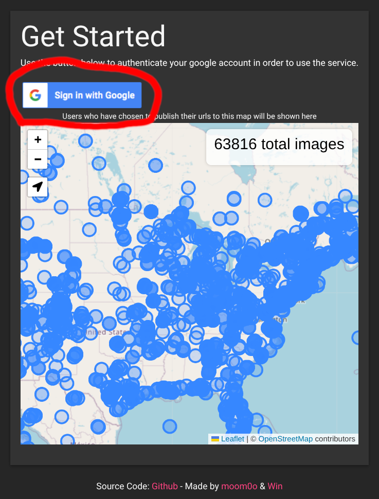

After that, you are able to add an image. When you do, the website automatically **loads the information** from it like the coordinates (if there are any).

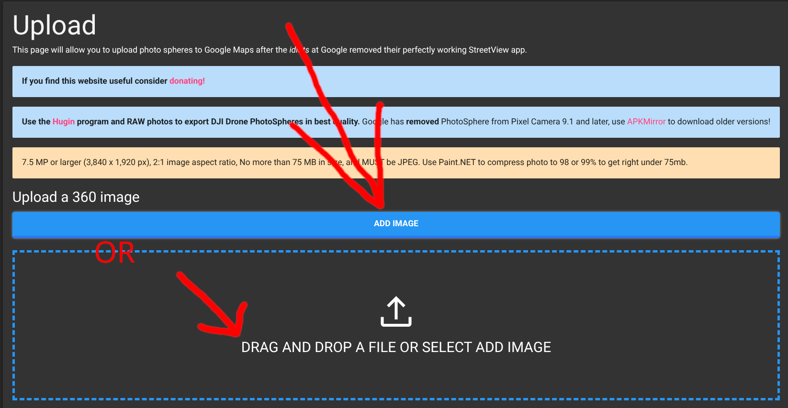

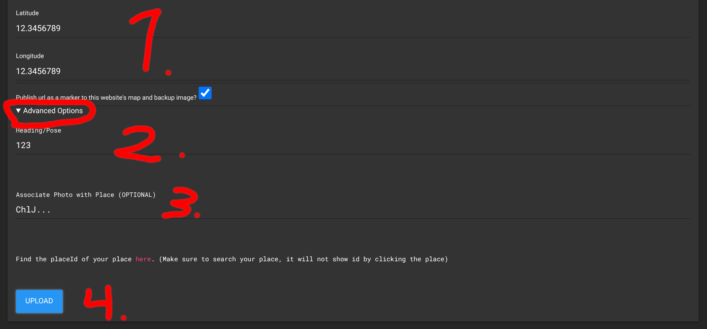

**1.**
You can always set custom coordinates - either because the website didn't detect any or because you want a more precise location for the photo.

The website also gives you the "Publish url as a marker to this website's map and backup image?" - which is up to you. Later deleting the image means it will also delete from the website.

At the bottom, there is an "advanced options" option - **click it**. 

**2.**
For individual photos (not planning on making a photo tour/traverse-able photos), you generally **don't** have to set the **Heading/pose**. However, if you are planning on making a **walk-able photo tour** (with the arrows), I **HEAVILY** recommend setting it.

If you don't know how to get your photo's heading, read [how to get a photo's heading 🟢](#getting-a-photos-heading-before-it-was-shot-) first.

**3.**
At the bottom now there is an optional field to set a placeId, which I **heavily recommend** you do - since this will associate the photo with a place instead of showing it as being an unknown place. You can check the [finding a placeId](#finding-a-placeid-) section. Also if you later need to find the photo's information, you can filter by the placeId

**4.**
Then you are **ready to upload the photo** - click on the "Upload" button and wait a bit for the website to process it. If you did everything right, will get a link for Google maps! You can also click the debug information option, where you will find the **ID of the photo**, which may be useful for other things in this guide.

Please check the [**Photos upload info/FAQ**](#photos-upload-infofaq-) section now!

## Photos upload info/FAQ ⚪
[⬆ Back to top](#top)

When you upload a photo, you have to **wait a few minutes** for it to start displaying a photo and for it to appear in your contributions tab on Google maps. Just keep refreshing the page using **CTRL + F5** (make sure to refresh this way due to the cache) until you see your photo! On phones, try to either wait longer or clear your browser's cache if you don't see your photo yet. If you have set any **placeIds**, you should be able to see the photo when you view the place on maps (though if the place has a lot of photos yours might be buried deep between them) - also in a few minutes.

When your photo gets uploaded, it will **NOT APPEAR** as a **blue circle (YET)**. It may take up to **three days** for your photo to appear as a blue circle on maps, if Google's algorithm deems it fit. There is no guarantee that it will appear as a blue circle, but from my testing, all of my photos did. You just have to be **patient**.

## A useful glossary ⚪
[⬆ Back to top](#top)

### General concepts

**Photo tour** - a set of connected 360 photos that people can walk through on Google Maps using the little arrows, similar to how Street View works on a road. This is what the "Creating connections" and "Heading/pose" parts of this guide are for.

**Blue circle** - the blue dot/circle Google Maps shows on the map once a photo has been reviewed and accepted by Google's algorithm. A photo can be uploaded and viewable without one - the blue circle just means it's been "promoted" a bit further. See the [Photos upload info/FAQ](#photos-upload-infofaq-) section.

**Contributions tab** - the page on Google Maps (found at [google.com/maps/contrib](https://www.google.com/maps/contrib/)) where you can see everything you've ever uploaded - photos, reviews, edits, etc. Several sections of this guide use it to find, view, or delete your photos.

### Pose & positioning

**Pose** - describes where a photo is and which way it's facing: its GPS location, its heading (direction), and how tilted the camera was when it was taken.

**Heading** - a number (in degrees) which shows where the **center** of the 360 picture is facing.

**Location (latLngPair)** - the GPS coordinates (latitude and longitude) of where the photo was taken.

**Pitch** - how far up or down the center of the photo is tilted, between **-90** (straight down) and **90** (straight up).

**Roll** - how tilted the camera was sideways, between **0** and **360** degrees, where **0** means level with the horizon.

**Level** - which floor of a building the photo was taken on. Used so Google Maps can show a floor switcher and let people navigate up and down between floors in an indoor photo tour.

**Altitude** - how high up the photo was taken, in meters. Not the same as level - this doesn't affect floor switching, it's just a raw height value.

### IDs & places

**An ID** - a unique identifier used so the server can identify the correct picture. It's usually a weird long thing because it has to be unique.

**photoId** - an ID for a photo. It identifies the photo and it's unique to that photo only.

**placeId** - an ID for a place. It identifies the place and it's unique to that place only.

**Connection(s)** - tell Google which photos should be linked together - which photos should be connected. This is what creates the walk-able arrows in a photo tour.

### Using the APIs

**API Explorer** - the interactive panel on the right side of a developers.google.com API page (the one this guide has you click into) where you can fill in fields and send a real API request without writing any code.

**Request parameters** - the fields near the top of the API Explorer panel, usually used for things like the photo's ID.

**Request body** - the JSON template you edit and paste into the API Explorer to tell the API what you actually want to change.

**Execute button** - the blue button in the API Explorer that actually sends your request to Google.

**updateMask** - a field you fill in (as part of the Request parameters) when you're updating a photo that tells the `photo.update` API exactly which piece of information you want to change - for example, `pose.heading` if you're only updating the heading. Without it, you'd risk overwriting other fields you didn't mean to touch.

### Photo JSON fields

These are fields you'll see when looking at a photo's information in a JSON response (see [How to actually find your photo in the JSON?](#how-to-actually-find-your-photo-in-the-json)).

**downloadUrl** - a link to download the actual full-resolution photo file. Only shows up if you set the `view` parameter to `INCLUDE_DOWNLOAD_URL`.

**shareLink** - a link that opens the photo directly on Google Maps. Useful for double-checking you've found the right photo in a big JSON response.

**thumbnailUrl** - a link to a small preview image of the photo.

**captureTime** - the timestamp of when the photo was actually taken.

**uploadTime** - the timestamp of when the photo was uploaded to Google.

**viewCount** - how many times the photo has been viewed.

**mapsPublishStatus** - whether the photo has been published to Google Maps or rejected.

## Deleting uploaded photos 🟢/🟡
[⬆ Back to top](#top)

**DELETION IS NOT REVERSIBLE.**

You will have to re-upload your photo.

### Deleting using the contributions tab 🟢
This is the **easiest way** to delete photos. First, you must open the **contributions** tab on either your computer or on your phone in the Google maps app. To simplify this, you can just go here: https://www.google.com/maps/contrib/

After that, navigate to the **photos section**. There, you'll see **all of your photos** you've ever uploaded. Scroll down to find your photo if it's old. When you find your photo, click on the **three dots** next to it and select delete. That's it!

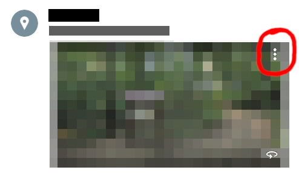

### Deleting using the API 🟡
Please **read** the [Using APIs - general guide 🟡](#using-apis---general-guide-) first if you haven't already. 

For this, we are going to use the [photo.delete](https://developers.google.com/streetview/publish/reference/rest/v1/photo/delete) API.

Simply prepare your photoId and put it in the "photoId" field. Then click execute at the bottom and you're done!

## Finding a placeId 🟢
[⬆ Back to top](#top)

I recommend using [this website](https://geo-devrel-javascript-samples.web.app/samples/places-placeid-finder/app/dist/) to find the placeId. Just open it, search for your place in the top left, select it and then copy the placeId from the map. Warning - you **HAVE to SEARCH** for it, just finding it and clicking on it won't give you the placeId.

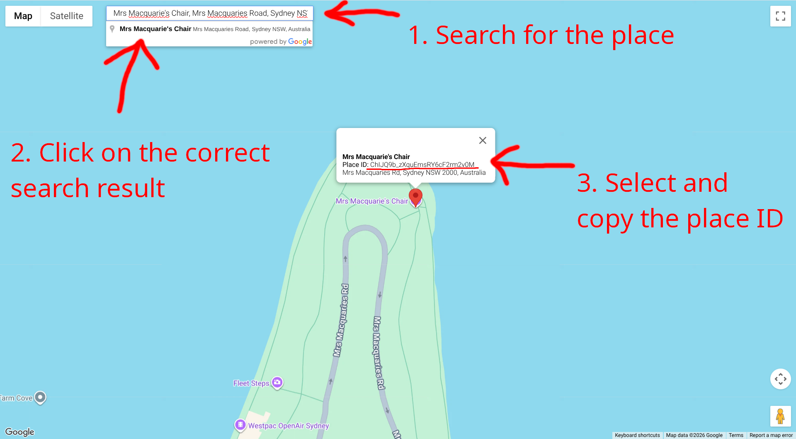

## Getting a photo's heading before it was shot 🟢
[⬆ Back to top](#top)

The easiest way to get a photo's heading is to note it down **while you're actually taking the photo**. Before you start shooting, open your phone's **compass app** (most phones have one built in) and **face the direction your 360 app starts recording from** (this is usually the direction you're facing when you press the shutter/start button - check how your specific app works if you're not sure). **Write down the heading number the compass shows** - that's your photo's heading!

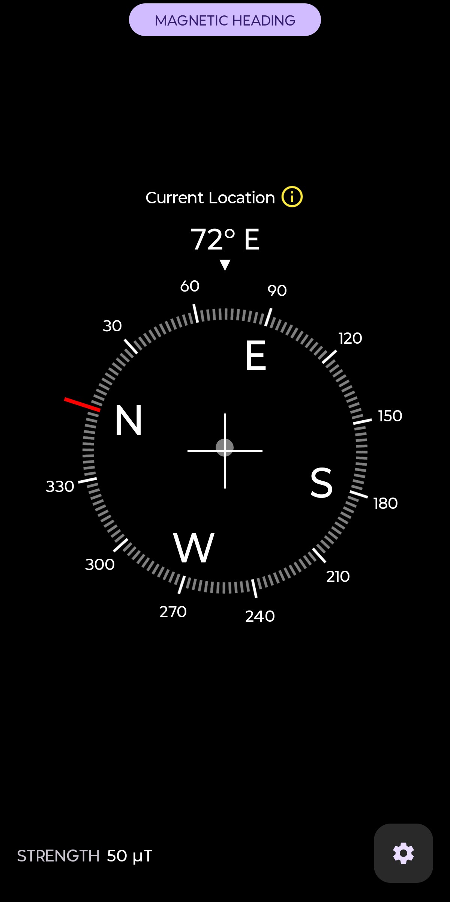
Image example: the heading number here would be 72.

It doesn't need to be perfectly precise - a few degrees off won't be noticeable.

**How it would look in action:**
1. Find a place where you'll be taking the 360 photo
2. Face towards where you'll take **the first** photo
3. Open the compass app and note down **the heading** - the number of degrees you're facing
4. **Take** the first photo and continue with the rest of the sphere

...And you're done! You have a 360 photo and its heading!

## Using APIs - general guide 🟡
[⬆ Back to top](#top)

This is a simple guide on how to generally use the APIs, which are in some of the sections in this guide. In the examples below, the API for updating photos will be used - but this is **general info for all of the APIs** here.

For using the APIs, I recommend doing this on **a laptop**. If you are using a phone, you have to use the **desktop version** of the website.

Now onto how to actually use them. Your page will open with **a lot of info** - fortunately you can **ignore most of it**. Focus on the **panel on the right** and **click the API button**.

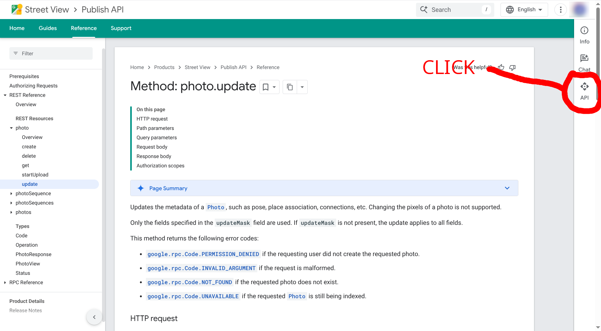

A **window will** open, which will look something like this (you may need to scroll up/down). The window has **three main parts** - **"Request parameters"**, where you will usually set things like the photo's ID. Then the **"Request body"** - you will usually find a template body in the API guide with some TEMPLATE_VARIABLES (indicated by the caps lock and underscores instead of spaces). 

Not every API has all three - read-only ones like photos.list only show Request parameters and Execute, no body. You should **edit the template body** (e.g. replace latitude/longitude text with actual values) and then you can **paste the whole body into the section** with two curly braces - just delete them and instead place the edited body template there. 

Finally, the blue **"Execute" button** - when you open the page for the first time (or after a long time), it will ask you to **log in** and give it permission to edit things on your account. This is safe since this is Google's official API - you need to **give the permissions** for everything to work. 

**YOU SHOULD ONLY ENTER THE PARAMETERS WHICH ARE IN THE GUIDE, OTHERWISE YOU MAY BREAK YOUR PHOTOS** - unless you read through the documentation on the pages and you understand how it works.

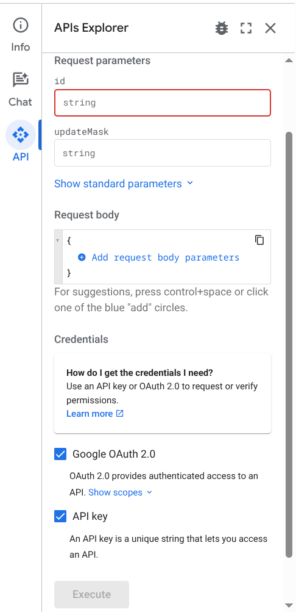

Lastly, when you have all of the values and the body filled in, **click the execute button**. It might take a moment, but a **response will appear underneath**. The response will include a number - the **number 200 meaning it was correct**. Also - generally, the response includes the photo's ID if it was correct (or information). If the number is **NOT 200**, then you probably did something wrong. You should re-check the parameters and the request body.

## Listing your uploaded photos 🟢 - 🔴
[⬆ Back to top](#top)

### Using the contributions tab 🟢

If you only want to see your photos which you've taken and **don't care** about the parameters or IDs, I recommend using the **contributions section**:
https://www.google.com/maps/contrib/

After that, navigate to the **photos section**. There, you'll see **all of your photos** you've ever uploaded. Scroll down to find your photo if it's old.

You'll see **all** photos - even non-360 ones. When you find it, you can **view** your photo by clicking on it. You can view the photo's location too. There are also options to **share** and **delete** the photo.

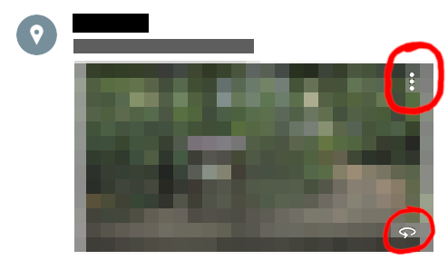

If you **do need** the parameters (like the photo's ID), continue on below.

### Using the API 🟡/🔴

This is useful if you want to see your photos' **current parameters and IDs**.

If you haven't already, please **read** the [Using APIs - general guide 🟡](#using-apis---general-guide-) first.

We are going to use the [photos.list](https://developers.google.com/streetview/publish/reference/rest/v1/photos/list) API for this.

For this API, you actually **don't need to fill-in** anything. You may **click execute** and it'll list up to 100 of your photos in a single JSON. If you have **more than 100 photos** in the response, scroll down and find this part:

```"nextPageToken": "YOU_NEED_THIS"```, for example ```"nextPageToken": "CJ7xN2mLQhcOae5T4pFRvBnKw2E"```

Copy the string. Then go back up to the fields. There is a field called ```pageToken```. Paste the weird string into the field and execute again. This will give you the next page of the response - so another 100 photos.

**Warning / side note**: Google's API docs show the ```view``` parameter as **required**. From my testing of executing the API requests on the web app, it's **not required**. If however it doesn't work for you, set the ```view``` parameter to ```BASIC``` or ```INCLUDE_DOWNLOAD_URL``` if you want to download them. I would recommend setting it for any manual API requests outside of the web app.

**IN THE JSON ITSELF:** You need to find your photo. Instructions are below the filter part.

However, as you can imagine, that can be pretty annoying. If your photo has a **placeId** linked, you may use that to your advantage!

You may filter the photos so it shows **only** the photos which have the same placeId filled.

To put it simply: See only the photos you've taken at a specific location.

If you don't know where to get the placeId of the place, please check [Finding a placeId 🟢](#finding-a-placeid-).


When you have your placeId, look at the filter field. Edit this template with your placeId and enter it there.
```
placeId=YOUR_PLACE_ID
```

A filled-in example could be something like this:
```
placeId=ChIJQ9b_zXquEmsRY6cF2rm2v0M
```

Paste the edited template into the **filter field**. After that click **execute**!

If no photos are returned (or a different code than 200), then either your placeId might be wrong OR there are no photos with the linked placeId.

#### How to actually find your photo in the JSON?
------

This might be the **hardest part** for some people. If you've never heard of anything like JSON or are really not technical, I honestly recommend copying the output to an **AI** and talking with it (recommended for most people 🟡).

To copy the output - click into the whole response body (below execute), **select everything** (you can use a keyboard shortcut like CTRL + A on Windows or COMMAND + A on Mac...) and then **copy** the whole output.

If you want to go through the JSON yourself (🔴), I **heavily recommend** copying it and pasting it into a text editor.

A JSON response will have **A LOT** of fields. Luckily, we don't need most of them. A full response will look something like this (you might have more or less fields depending on your photo):

```json
{
  "photos": [
    {
      "photoId": {
        "id": "CAoSLEFGMVFpcE1zYW1wbGVQaG90b0lkRXhhbXBsZTEyMzQ1Njc4OTBhYmNk"
      },
      "downloadUrl": "https://lh3.googleusercontent.com/gpms-cs-s/EXAMPLE_DOWNLOAD_TOKEN_1a2b3c4d5e6f7g8h9i0j==w0-h0-k-no-d",
      "pose": {
        "latLngPair": {
          "latitude": 48.858093,
          "longitude": 2.294694
        },
        "heading": 112.5,
        "level": {}
      },
      "connections": [
        {
          "target": {
            "id": "CAoSLEFGMVFpcE5leHRQaG90b0lkRXhhbXBsZTA5ODc2NTQzMjFsbW5vcA=="
          }
        }
      ],
      "captureTime": "2026-05-02T00:00:00Z",
      "places": [
        {
          "placeId": "ChIJLU7jZClu5kcR4PcOOO6p3I0",
          "name": "Champ de Mars",
          "languageCode": "en"
        }
      ],
      "thumbnailUrl": "https://lh3.googleusercontent.com/gpms-cs-s/EXAMPLE_DOWNLOAD_TOKEN_1a2b3c4d5e6f7g8h9i0j==w568-h256-k-no",
      "viewCount": "342",
      "shareLink": "https://www.google.com/maps/@48.858093,2.294694,3a,75y,112.5h,90t/data=!3m4!1e1!3m2!1sAF1QipMsamplePhotoIdExample!2e10",
      "mapsPublishStatus": "PUBLISHED",
      "uploadTime": "2026-05-10T09:30:00Z"
    }
  ]
}
```

...Wow. That's a lot. And this is just for **one single photo**.

First, we need to identify the photo. For that we don't actually need that many fields:
```json
{
  "photos": [
    {
      "photoId": {
        "id": "CAoSLEFGMVFpcE1zYW1wbGVQaG90b0lkRXhhbXBsZTEyMzQ1Njc4OTBhYmNk"
      },
      "pose": {
        "latLngPair": {
          "latitude": 48.858093,
          "longitude": 2.294694
        }
      },
      "captureTime": "2026-05-02T00:00:00Z",
      "places": [
        {
          "placeId": "ChIJLU7jZClu5kcR4PcOOO6p3I0",
          "name": "Champ de Mars",
          "languageCode": "en"
        }
      ],
      "shareLink": "https://www.google.com/maps/@48.858093,2.294694,3a,75y,112.5h,90t/data=!3m4!1e1!3m2!1sAF1QipMsamplePhotoIdExample!2e10",
      "uploadTime": "2026-05-10T09:30:00Z"
    }
  ]
}
```
Here, we can use the following fields to **identify the photo**:
* **latitude and longitude** numbers - those are the coordinates of the photo.
* **captureTime** and **uploadTime** - those are timestamps of when you took the photo and when you uploaded it.
* **places** -> **name(s)** - those are the linked places (those you link using the placeId). You can use the names of the linked places, which can also be useful when you're trying to find your photo
* **shareLink** - this is the share link of your photo. When you open it, you'll se your photo! This is best for confirming if it's the right one.

When you **identify** which photo is yours, you can look at the whole response. Using the fields you see, you can get the information you need - for example the photo's ID or information about the photo like its heading!

#### How to download your photos
------
Please **read** the [Listing your uploaded photos using the API](#using-the-api-) first if you haven't already.

If you want to **download the 360 photo** you uploaded to Google, this is for you!

Unlike the thumbnail or share link, this gives you the actual full-resolution photo file.

To actually do this, prepare your request as you would normally (what was described above). You only have to change **one thing**.

Look at the ```view``` parameter. There's nothing under it! Don't worry, that's normal. Click on the **empty field** under the view parameter. A drop down menu will appear. Select the option that says ```INCLUDE_DOWNLOAD_URL```.

With the **option selected**, you may click **execute**!

The result will look the same - with one tiny change. It will include a ```downloadUrl``` right under the photo's ID (you may look at the first example JSON response - it has that parameter).

It will usually look something like this:
```json
"downloadUrl": "https://lh3.googleusercontent.com/gpms-cs-s/EXAMPLE_DOWNLOAD_TOKEN_1a2b3c4d5e6f7g8h9i0j==w0-h0-k-no-d"
```

Copy just the URL part inside the quotation marks - not the quotes themselves:

```https://lh3.googleusercontent.com/gpms-cs-s/EXAMPLE_DOWNLOAD_TOKEN_1a2b3c4d5e6f7g8h9i0j==w0-h0-k-no-d```

**Open the link** in your browser and your photo will get downloaded automatically. If that doesn't happen or show an error page (e.g. error 400), make sure to check if you copied the link **exactly** as it is in the response. It won't work otherwise (a single missing character might break it).

And you're done!

## Updating photos' information 🟡
[⬆ Back to top](#top)

We are going to use the [photo.update](https://developers.google.com/streetview/publish/reference/rest/v1/photo/update) API for this. Don't worry - it's not going to be hard. Please **read** the [Using APIs - general guide 🟡](#using-apis---general-guide-) first.

Once a photo is uploaded, you can update almost anything about it - its connections, its heading/pose, or the placeId it's linked to - without re-uploading it. All of this is done with the same photos.update API, just with a different updateMask and request body depending on what you want to change.

When you open the API's page, you will see three important fields - below "Request parameters", there is **"id" and "updateMask"**. In the id field (field below id), paste the **photo's whole ID** (the photo whose information you want to update). You will be told what to put in the updateMask field based on what you want to update.


### Updating heading
Please read [updating photos' information](#updating-photos-information-) if you haven't already before proceeding.

In the updateMask field, type out ```pose.heading```.
By doing this, we tell the API that we want to update the photo's heading.

For the request body, just **edit this template** and **replace** ```YOUR_HEADING_NUMBER``` with the photo's heading.

```json
{
  "pose": {
    "heading": YOUR_HEADING_NUMBER
  }
}
```

A filled-in template example might look like this:

```json
{
  "pose": {
    "heading": 173.56
  }
}
```

**Paste** your filled-in body into the "Request body" field (or first paste it and then edit it) and feel free to **press** the **execute button**!

A complete **filled-in example** might look like this:

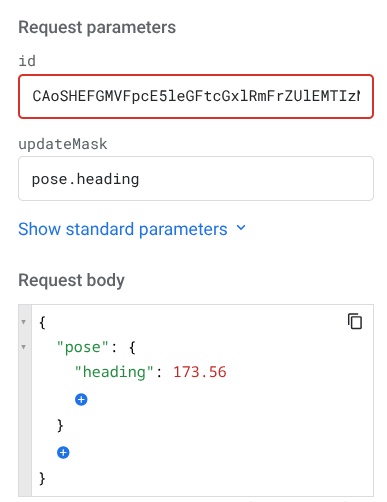

### Updating linked places (placeIDs)
Please read [updating photos' information](#updating-photos-information-) if you haven't already before proceeding.

In the updateMask field, type out ```places```.
By doing this, we tell the API that we want to update the photo's linked places.

For the request body, just **edit this template** and **replace** ```YOUR_PLACE_ID``` with the place's ID.

If you **don't know** how to get the placeId, check out [Finding a placeId 🟢](#finding-a-placeid-).


```json
{
  "places": [
    {
      "placeId": "YOUR_PLACE_ID"
    }
  ]
}
```

A filled-in template example might look like this:
```json
{
  "places": [
    {
      "placeId": "ChIJQ9b_zXquEmsRY6cF2rm2v0M"
    }
  ]
}
```

**Paste** your filled-in body into the "Request body" field (or first paste it and then edit it) and feel free to **press** the **execute button**!

It's also possible that your photo has **multiple places** in it. Luckily, you **can** have multiple placeIds!

```json
{
  "places": [
    {
      "placeId": "YOUR_FIRST_PLACE_ID"
    },
    {
      "placeId": "YOUR_SECOND_PLACE_ID"
    }
  ]
}
```
Note: it **doesn't matter** which place you put first. You can also **continue this sequence** to have your photo linked to even more places!

A complete **filled-in example** might look like this:

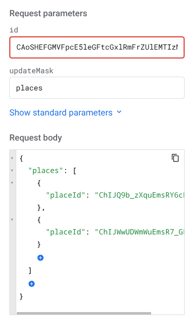

### Updating location
Please read [updating photos' information](#updating-photos-information-) if you haven't already before proceeding.

In the updateMask field, type out ```pose.lat_lng_pair```.
By doing this, we tell the API that we want to update the photo's latitude and longitude.

For the request body, just **edit this template** and **replace** ```LATITUDE_NUMBER``` and ```LONGITUDE_NUMBER``` with the numbers. Here's the template:
```json
{
  "pose": {
    "latLngPair": {
      "latitude": LATITUDE_NUMBER,
      "longitude": LONGITUDE_NUMBER
    }
  }
}
```

A filled-in template example might look like this:
```json
{
  "pose": {
    "latLngPair": {
      "latitude": 40.71966068310044,
      "longitude": -73.84973789565215
    }
  }
}
```

An example of how it might look like filled in:

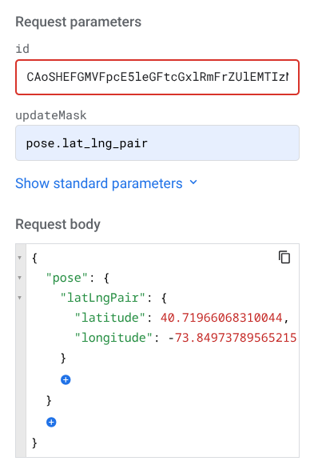

**Paste** your filled-in body into the "Request body" field (or first paste it and then edit it) and feel free to **press** the **execute button**!

### Updating connections (Linking photos)
Please read [updating photos' information](#updating-photos-information-) if you haven't already before proceeding.

#### Single connections
------

**YOU WILL HAVE TO DO THIS REQUEST MULTIPLE TIMES - IF YOU WANT TO CONNECT TWO PHOTOS, YOU WILL HAVE TO DO THIS FOR THE FIRST PHOTO AND THEN FOR THE SECOND (or then later n'th photo)**

In the updateMask field, type out ```connections```.
By doing this, we tell the API that we want to update the specific photo's connections.

Now for the request body. The request body will vary by how many connections the photo has - how many photos you want connected to it, how many walk-able arrows.

For only one connection, the body will look like this:
```json
{
  "connections": [
    {
      "target": {
        "id": "ID_OF_PHOTO_WHICH_YOU_WANT_TO_CONNECT"
      }
    }
  ]
}
```
Replace ```ID_OF_PHOTO_WHICH_YOU_WANT_TO_CONNECT``` with the ID of the photo you want to connect. If you have photo A and photo B and you want to connect photo A to photo B, you will type photo A's ID in the **request parameters field** and photo B's ID in the **request body**.

**YOU WILL HAVE TO DO THIS REQUEST MULTIPLE TIMES - IF YOU WANT TO CONNECT TWO PHOTOS, YOU WILL HAVE TO DO THIS FOR PHOTO A AND THEN FOR PHOTO B**

Let's look at an example. Let's say we want to link a photo with the ID ```CAoSHUFGMVFpcE16elR1dG9yaWFsU2FtcGxlSWQ5ODc2``` to the photo with the ID ```CAoSHEFGMVFpcE5leGFtcGxlRmFrZUlEMTIzNDU2Nzg.```. We will first have to **fill the first id** field (under Request parameters) to the first photo's id. We then set the mask to ```connections```. Lastly, we will then **edit the body** template to have the second photo's ID:
```json
{
  "connections": [
    {
      "target": {
        "id": "CAoSHEFGMVFpcE5leGFtcGxlRmFrZUlEMTIzNDU2Nzg."
      }
    }
  ]
}
```

How it looks on the website (some of the IDs are cut off because of the length):

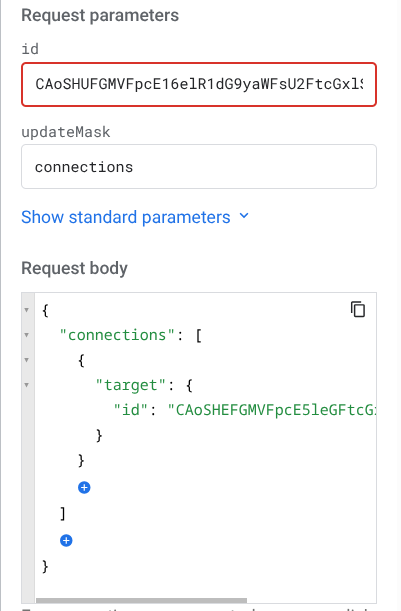

**Paste** your filled-in body into the "Request body" field (or first paste it and then edit it) and feel free to **press** the **execute button**!

#### Multiple connections
------

This is almost the same as single connections, except you edit the body to have more connections - meaning **only the body changes**. This is the example for two connections:
```json
{
  "connections": [
    {
      "target": {
        "id": "ID_OF_THE_FIRST_PHOTO_WHICH_YOU_WANT_TO_CONNECT"
      }
    },
    {
      "target": {
        "id": "ID_OF_THE_SECOND_PHOTO_WHICH_YOU_WANT_TO_CONNECT"
      }
    }
  ]
}
```

For three links:
```json
{
  "connections": [
    {
      "target": {
        "id": "ID_OF_THE_FIRST_PHOTO_WHICH_YOU_WANT_TO_CONNECT"
      }
    },
    {
      "target": {
        "id": "ID_OF_THE_SECOND_PHOTO_WHICH_YOU_WANT_TO_CONNECT"
      }
    },
    {
      "target": {
        "id": "ID_OF_THE_THIRD_PHOTO_WHICH_YOU_WANT_TO_CONNECT"
      }
    }
  ]
}
```
... and so on. The rest of the request (first id, updateMask) stays the same. **Don't forget to do this for all of the photos!**

### Updating pitch and roll
Please read [updating photos' information](#updating-photos-information-) if you haven't already before proceeding.

Note: I don't have personal experience with this topic, so some of the information might be slightly wrong.

In the updateMask field, type out ```pose.pitch,pose.roll```.
By doing this, we tell the API that we want to update the photo's pitch and roll.

**Pitch** is how far up or down the center of the photo is tilted - a value between **-90** (looking straight down) and **90** (looking straight up). **Roll** is how tilted the camera was sideways, measured in degrees between **0** and **360**, where **0** means level with the horizon.

Most people **won't need** to touch these - if your photo already looks right when you view it, you probably don't need to set them. This is mainly useful if your photo tour/spheres look slightly tilted or "off" and you want to correct it manually.

For the request body, just **edit this template** and **replace** ```YOUR_PITCH_NUMBER``` and ```YOUR_ROLL_NUMBER``` with your values.

```json
{
  "pose": {
    "pitch": YOUR_PITCH_NUMBER,
    "roll": YOUR_ROLL_NUMBER
  }
}
```

A filled-in template example might look like this:

```json
{
  "pose": {
    "pitch": 0,
    "roll": 2.5
  }
}
```

**Paste** your filled-in body into the "Request body" field (or first paste it and then edit it) and feel free to **press** the **execute button**!

A complete **filled-in example** might look like this:


### Updating level
Please read [updating photos' information](#updating-photos-information-) if you haven't already before proceeding.

Note: I don't have personal experience with this topic, so some of the information might be slightly wrong.

In the updateMask field, type out ```pose.level```.
By doing this, we tell the API that we want to update the photo's level.

**Level** is which **floor** of a building the photo was taken on - useful if you're photographing somewhere like a mall or an office building with multiple floors, since this is what lets Google Maps show a **floor switcher** and let people navigate **up and down** between floors in your tour. It needs a **number** (0 = ground floor, 1 = first floor above ground, -1 = first floor below ground, and so on) and a **name** (max 3 characters - think of how an elevator button for that floor would be labeled).

You only need this if you're doing an **indoor, multi-floor** photo tour and want floor-to-floor navigation to work. A single-floor or outdoor tour doesn't need it.

For the request body, just **edit this template** and **replace** ```YOUR_LEVEL_NUMBER``` and ```YOUR_LEVEL_NAME``` with your values.

```json
{
  "pose": {
    "level": {
      "number": YOUR_LEVEL_NUMBER,
      "name": "YOUR_LEVEL_NAME"
    }
  }
}
```

A filled-in template example might look like this:

```json
{
  "pose": {
    "level": {
      "number": 1,
      "name": "1F"
    }
  }
}
```

**Paste** your filled-in body into the "Request body" field (or first paste it and then edit it) and feel free to **press** the **execute button**!

### Updating altitude
Please read [updating photos' information](#updating-photos-information-) if you haven't already before proceeding.

Note: I don't have personal experience with this topic, so some of the information might be slightly wrong.

In the updateMask field, type out ```pose.altitude```.
By doing this, we tell the API that we want to update the photo's altitude.

**Altitude** is simply how high up the photo was taken, measured in **meters**. Unlike `level`, this isn't tied to floor navigation - it's just a raw height value stored on the photo's pose, similar to latitude/longitude but for the vertical axis.

**Honestly, it's not entirely clear what visible effect this has** - Google's documentation doesn't go into detail beyond the field definition. Set it if you happen to have accurate altitude data and want the photo's metadata to be complete, but feel free to skip it if you're not sure - it isn't required for a photo tour to work.

For the request body, just **edit this template** and **replace** ```YOUR_ALTITUDE_NUMBER``` with your value.

```json
{
  "pose": {
    "altitude": YOUR_ALTITUDE_NUMBER
  }
}
```

A filled-in template example might look like this:

```json
{
  "pose": {
    "altitude": 12.5
  }
}
```

**Paste** your filled-in body into the "Request body" field (or first paste it and then edit it) and feel free to **press** the **execute button**!
